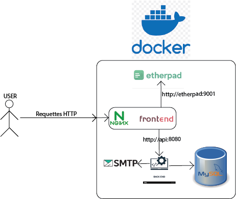

# Projet TLC

## Auteurs

- **BERROUCHE Issameddine**
- **HAMONO Morvan**

## Lancement de l'application

- Clonez le projet
- Placez-vous à la racine du projet
- Exécutez la commande suivante pour générer les images docker : ```sudo bash quicklaunch.sh -a```

Nous avons créé ce script pour nous aider à déployer rapidement notre application pendant le développement, et pour nettoyer les images docker entre chaque déploiement. Nous nous sommes rendu compte que cela pouvait être utile pour la pipeline CI/CD. Nous n'avons pas eu le temps de le mettre en place, mais nous avons laissé le script pour montrer notre démarche.

## Tâche 4


